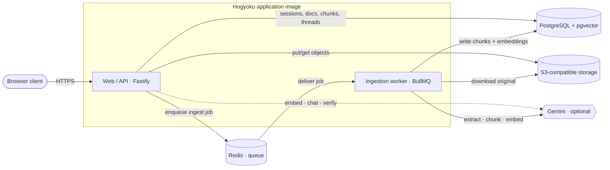
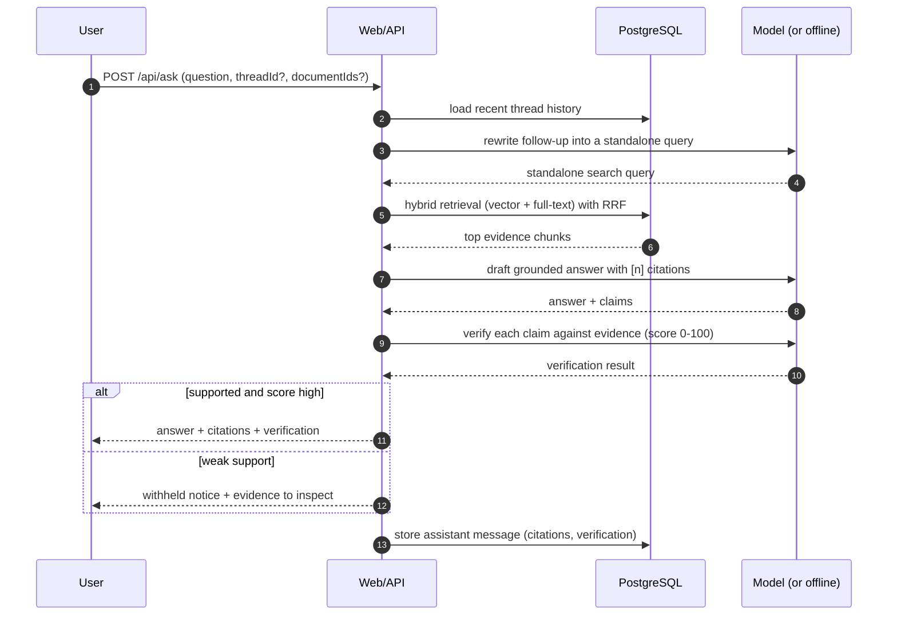
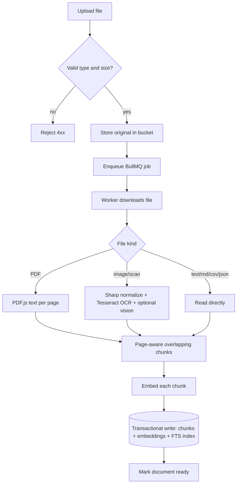

# Architecture

Diagrams for how Hogyoku is wired and how data flows. These render on GitHub
(Mermaid). For the narrative version, see [../OVERVIEW.md](../OVERVIEW.md).

## System topology

The web service and the worker run from the **same container image** with
different start commands. OCR and embedding happen on the worker so they never
block HTTP traffic. Gemini is optional — without it, deterministic local paths
are used.

## Ask pipeline (v2, conversational)

## Ingestion pipeline

## Retrieval detail

A single SQL statement computes two rankings and fuses them with Reciprocal
Rank Fusion:

- **Semantic rank** — `embedding <=> query` cosine distance over a `pgvector`
  HNSW index.
- **Lexical rank** — `ts_rank_cd` over a generated `tsvector` using
  `websearch_to_tsquery`.
- **Fusion** — `1/(60 + semantic_rank) + 1/(60 + lexical_rank)` (lexical term
  only counts when there is a lexical match), ordered by the combined score and
  scoped to the requesting user's `ready` documents.

This gives precise keyword matches *and* semantic recall without a separate
search service.
